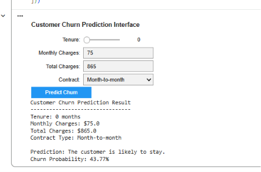

# Customer Churn Prediction Using Machine Learning

An end-to-end machine learning solution for predicting telecom customer churn using Random Forest, hyperparameter tuning, feature importance analysis, and an interactive prediction interface built with Google Colab.
---

## Project Overview

Customer churn is one of the biggest challenges for subscription-based businesses. Identifying customers who are likely to leave allows companies to take proactive actions that improve customer retention and reduce revenue loss.

This project develops an optimized Random Forest classification model capable of predicting whether a customer is likely to churn based on demographic information, subscribed services, billing details, and contract information.

---

## Project Objectives

- Explore and understand customer behavior.
- Clean and preprocess the dataset.
- Engineer meaningful features.
- Train a machine learning classification model.
- Optimize model performance using GridSearchCV.
- Explain model decisions using Feature Importance.
- Predict churn for new customers using an interactive interface.

---

# Machine Learning Workflow

## 1. Data Exploration

- Dataset inspection
- Missing value handling
- Exploratory Data Analysis (EDA)
- Customer churn distribution
- Feature relationship analysis

---

## 2. Data Preprocessing

- Data cleaning
- Data type conversion
- One-Hot Encoding
- Feature Engineering
- Train/Test Split

---

## 3. Model Development

Algorithm used:

- Random Forest Classifier

Model optimization:

- Hyperparameter Tuning
- GridSearchCV
- 5-Fold Cross Validation

---

## 4. Model Evaluation

Evaluation Metrics:

- Accuracy
- Precision
- Recall
- F1-Score
- Confusion Matrix
- Classification Report

---

## 5. Model Explainability

The project identifies the most influential variables affecting customer churn using Feature Importance analysis.

Top important features include:

- Tenure
- Total Charges
- Monthly Contract
- Monthly Charges
- Online Security
- Technical Support

---

## 6. Interactive Prediction Interface

A user-friendly interface was developed using **ipywidgets** inside Google Colab.

Users can:

- Enter customer information
- Select contract type
- Click **Predict Churn**
- Instantly receive a prediction from the optimized Random Forest model

---

# Model Performance

| Metric | Result |
|--------|--------|
| Initial Accuracy | 78.50% |
| Optimized Accuracy | 80.62% |
| Algorithm | Random Forest |
| Hyperparameter Optimization | GridSearchCV |
| Cross Validation | 5-Fold |

---

# Key Insights

- Customers with shorter tenure are more likely to churn.
- Month-to-month contracts have a higher churn risk than long-term contracts.
- Customers with higher monthly charges tend to have a greater probability of leaving.
- Hyperparameter tuning improved the model accuracy from **78.50%** to **80.62%**.

---

# Technologies Used

- Python
- Pandas
- NumPy
- Matplotlib
- Seaborn
- Scikit-learn
- Google Colab
- ipywidgets

---

# Repository Structure

```
customer-churn-prediction-ml
│
├── Customer_Churn_Prediction.ipynb
├── Customer_Churn_Prediction_Report.pdf
├── Telco-Customer-Churn.csv
├── README.md
└── images
    ├── confusion_matrix.png
    └── feature_importance.png
```

---

# Project Preview

## Confusion Matrix


---

## Feature Importance


---

# Future Improvements

- Deploy the model as a Streamlit web application.
- Compare Random Forest with XGBoost and LightGBM.
- Add SHAP explainability for individual predictions.
- Deploy the model using Flask or FastAPI.
- Connect the model to a real customer database.

---

# Skills Demonstrated

- Data Cleaning
- Exploratory Data Analysis
- Feature Engineering
- Feature Encoding
- Machine Learning
- Model Evaluation
- Hyperparameter Optimization
- Model Explainability
- Interactive Model Deployment

---

## Interactive Prediction Interface

The project includes an interactive prediction interface built with **ipywidgets**, allowing users to enter customer information and instantly receive churn predictions.



---

# Author

**Mohammed Harkan**

Business Intelligence Analyst Student

GitHub

https://github.com/Mohammedharkan
